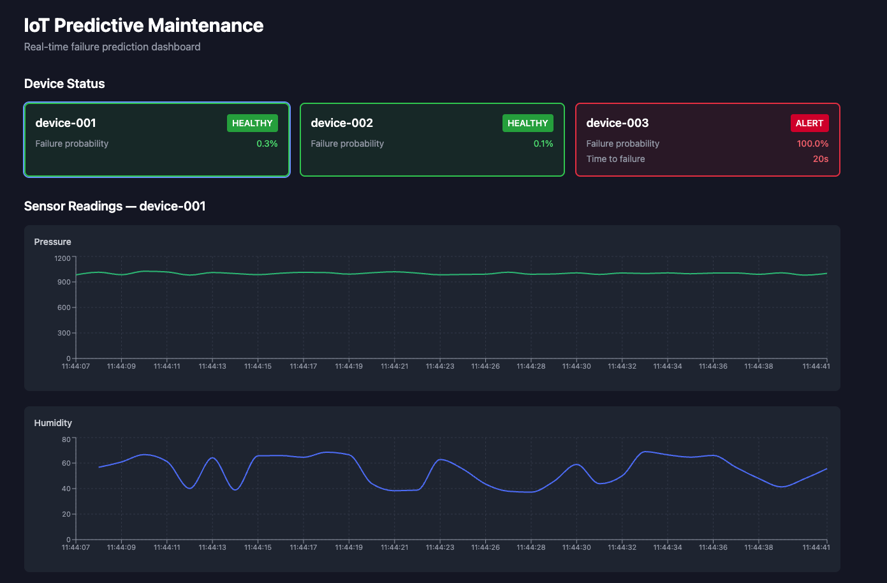
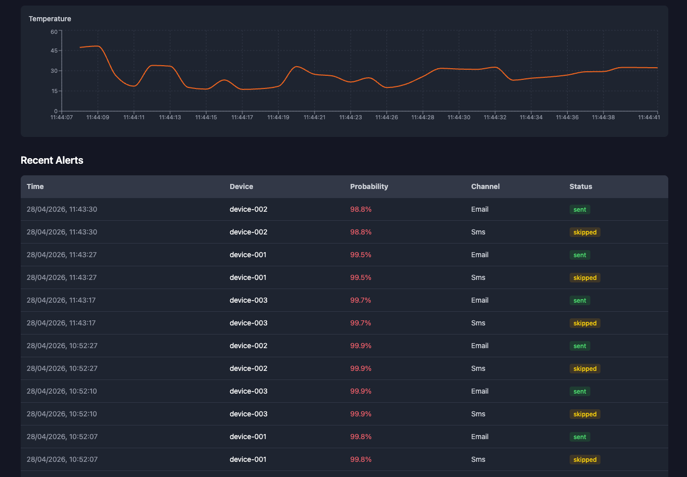

# IoT Predictive Maintenance

Real-time failure prediction system for IoT devices. Simulates sensor data, ingests it into TimescaleDB, trains an ML model to predict failures before they happen, and surfaces everything through a live dashboard with email/SMS alerts.

## Architecture

```
┌──────────────┐   MQTT    ┌─────────────┐   SQL    ┌─────────────────┐
│ IoT Simulator├──────────►│  Ingestion   ├────────►│   TimescaleDB   │
└──────────────┘           └─────────────┘          └────────┬────────┘
                                                             │
                                              ┌──────────────┼──────────────┐
                                              │              │              │
                                        ┌─────▼─────┐ ┌─────▼─────┐ ┌─────▼─────┐
                                        │  ML Model  │ │ Model API │ │  Alerts   │
                                        │ (Training) │ │ (FastAPI) │ │ (SMS/Email│)
                                        └───────────┘ └─────┬─────┘ └───────────┘
                                                             │
                                                       ┌─────▼─────┐
                                                       │ Frontend  │
                                                       │  (React)  │
                                                       └───────────┘
```

### Services

| Service | Description |
|---|---|
| **iot-simulator** | Generates fake sensor data (temperature, humidity, pressure) with periodic failure degradation patterns |
| **mosquitto** | MQTT broker for real-time sensor data transport |
| **ingestion** | Subscribes to MQTT and writes sensor readings into TimescaleDB |
| **timescaledb** | Time-series database storing all sensor data and alert history |
| **ml-model** | Trains a HistGradientBoosting classifier (failure prediction) and regressor (time-to-failure estimation) |
| **model-api** | FastAPI service exposing `/predict`, `/sensors/recent`, and `/alerts/recent` endpoints |
| **frontend** | React + Tailwind dashboard with live-updating device cards, sensor charts, and alert history |
| **alerts** | Polls the model API, sends email (Nodemailer) and SMS (Twilio) alerts when failure probability exceeds threshold |

## Dashboard

The dashboard shows real-time device health status, sensor readings, and alert history.

**Device status cards and sensor charts** -- each device shows its failure probability and estimated time to failure. Cards are color-coded: green for healthy, red for alert. Click a device to view its sensor readings (pressure, humidity, temperature).



**Temperature chart and alert history** -- the temperature chart tracks real-time readings for the selected device. The alert table logs every triggered alert with timestamp, device, probability, channel (Email/SMS), and delivery status.



## Getting Started

### Prerequisites

- Docker and Docker Compose

### Setup

1. Clone the repository:
   ```bash
   git clone <repo-url>
   cd prediction-project
   ```

2. Create your environment file:
   ```bash
   cp .env.example .env
   ```

3. Fill in the required values in `.env`:
   ```
   DB_USER=iot
   DB_PASSWORD=your_password
   DB_NAME=iot_data
   ```

4. Start all services:
   ```bash
   docker compose up --build
   ```

5. Open the dashboard at `http://localhost:3000`

### Training the Model

The ML model needs sensor data before it can make predictions. Let the simulator run for a few minutes to generate enough data, then:

```bash
docker compose run ml-model
```

The model API will automatically load the trained model on next restart.

## Environment Variables

See [`.env.example`](.env.example) for the full list. Key variables:

| Variable | Description |
|---|---|
| `DB_USER`, `DB_PASSWORD`, `DB_NAME` | PostgreSQL/TimescaleDB credentials |
| `DB_PORT` | Database port (default: 5432) |
| `MQTT_PORT` | MQTT broker port (default: 1883) |
| `API_PORT` | Model API port (default: 8000) |
| `FRONTEND_PORT` | Dashboard port (default: 3000) |
| `VITE_API_URL` | API URL the frontend connects to |
| `SMTP_HOST`, `SMTP_USER`, `SMTP_PASS` | Email alert configuration |
| `TWILIO_ACCOUNT_SID`, `TWILIO_AUTH_TOKEN` | SMS alert configuration |

## Tech Stack

- **ML**: scikit-learn (HistGradientBoosting), pandas, joblib
- **API**: FastAPI, psycopg2
- **Frontend**: React, Tailwind CSS, Recharts
- **Data**: TimescaleDB (PostgreSQL), MQTT (Mosquitto)
- **Alerts**: Nodemailer, Twilio
- **Infra**: Docker Compose
